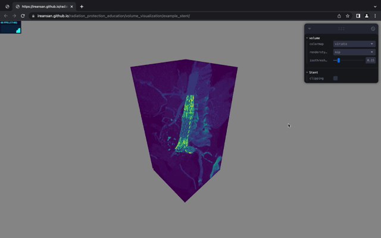
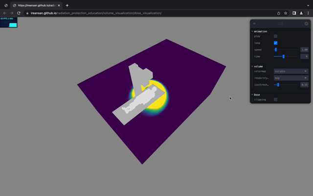
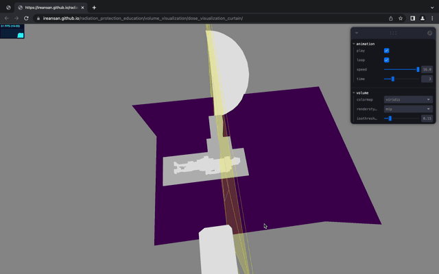
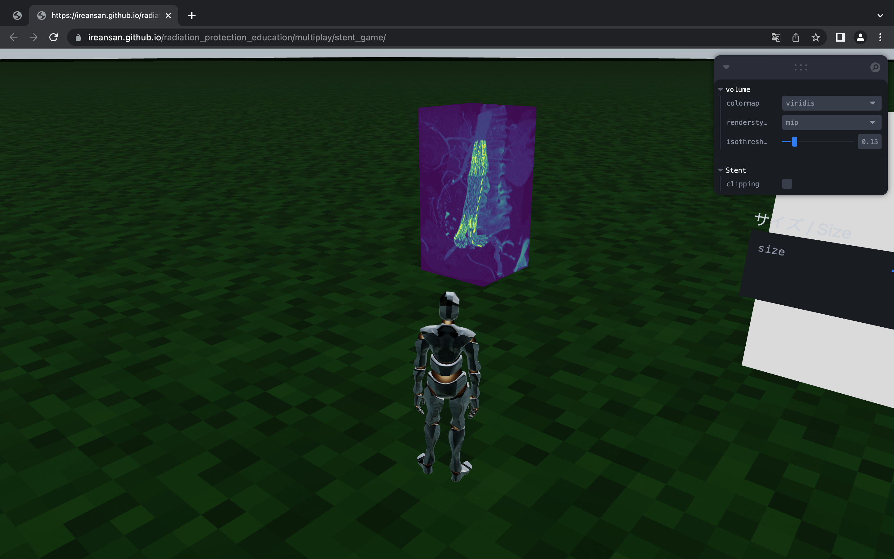
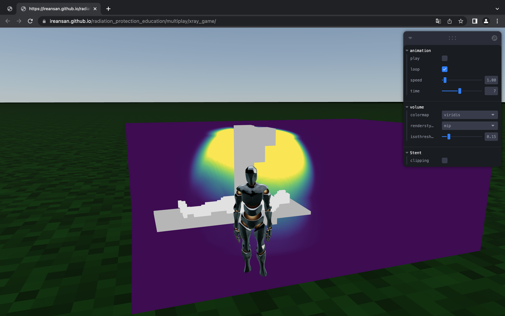

<h1> Radiation Protection Education </h1>

URL: https://ireansan.github.io/radiation_protection_education/

## コンテンツ紹介
### 1. 3D可視化教材
ボリュームレンダリングを用いてデータを可視化。
#### 1.1. Example Stent.nrrd
Three.jsのサンプル([Link](https://threejs.org/examples/?q=texture3d#webgl2_materials_texture3d))にクリッピングの機能を追加したもの。

#### 1.2. Dose Visualization
ボリュームデータのアニメーション機能によって，放射線分布の時間変化を任意方向の断面から確認できる。

#### 1.3. Dose Visualization Curtain
2つのアニメーション付きのデータを比較できる。動画内のクリッピング平面の左側は防護カーテンあり，右側は防護カーテンなしのデータになっている。

### 2. VR教材
#### 2.1. Game Template
FPS/TPSゲームとして最低限必要なキャラクターコントローラーを実装したテンプレート用のページ。浮遊しながら回転している色付きのボックスをクリックすることで，プレイヤーモデルの本体と関節の色を変更できる。

#### 2.2. Stent + Game
自身で制作したボリュームレンダリング用オブジェクトが，Three.jsの他のオブジェクトと同様に扱えることを確認するために，[Example Stent.nrrd](#11-example-stentnrrd)で用いたオブジェクトを[Game Template](#21-game-template)内に配置したページ。

#### 2.3. XRay + Game
[Stent + Game](#22-stent--game)と同様に，[Dose Visualization](#12-dose-visualization)内で用いたデータを[Game Template](#21-game-template)内に配置したページ。

