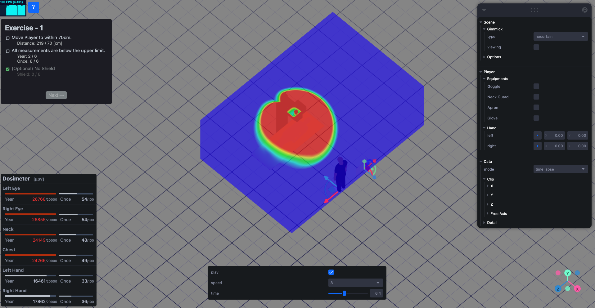

# Radiation Protection Education

## Overview


## Prerequisites
Install [Docker Desktop](https://docs.docker.com/get-docker/) for Mac, Windows, or Linux.
Docker Desktop includes Docker Compose as part of the installation.

### Versions
- Docker: ^20.10.20
- Docker Desktop: ^4.13.1 (90346)

## Installation
```
$ git clone https://github.com/YoshihiroOkadaLab/radiation_protection_education.git
$ cd radiation_protection_education
$ touch .env
$ docker compose -f docker-compose.yml build
$ docker compose -f docker-compose.yml up
```

## Reference
- Next.js / Examples / With Docker Compose
    https://github.com/vercel/next.js/tree/canary/examples/with-docker-compose
- React Three Fiber / Examples / Racing game
    https://codesandbox.io/p/sandbox/racing-game-lo6kp
- Three.js / Examples / materials / texture3d
    https://threejs.org/examples/#webgl2_materials_texture3d