# 評価実験 (可視化教材, 一回目)

## 実験内容
レントゲン室，Cアームの少なくとも一つのページで，可視化教材としてチェックリストの内容を全て実施していただきます。

全て実施すると，下図の左側から右側のようになり，Google フォームのリンクがアクセス可能になるので，回答をお願いいたします。

    

### チェックリスト
注意：一度，操作を行うと「実施した」と記録されるため，全ての項目を同時に満たす必要はありません。

#### equipments
操作パネルの`Player/Equipments`で，4つの装備全てを有効にする

#### data mode
操作パネルの`Data/mode`を操作し，`time lapse`, `accumulate`の2つのデータモードで，線量分布を確認する

#### color map
操作パネルの`Data/Parameter/colormap`を操作し，全13種類のカラーマップを，全て確認する

#### render style
操作パネルの`Data/Parameter/renderstyle`を操作し，`mip`, `iso`の2つのレンダリングスタイルで線量分布を確認する

#### clip x, y, z, free axis
操作パネルの`Data/Clip`で，全てのクリッピング平面を有効にする

#### clip invert
操作パネルの`Data/Clip`内のいづれか1つのクリッピング平面の向きを`invert`を有効にし，反転させる

#### player
3D空間内のコントローラーを操作し，playerの位置と両手の位置を変える

#### shield
3D空間内のコントローラーを操作し，防護板を線量分布内に入れ，移動させることで線量がどのように変わるか確認する

# 画面構成
この教材の画面構成は大きく3つに分かれています。

[img/canvas]
<!-- FIXME: -->

### 3D空間
線量分布データや，プレイヤーのとしての3Dオブジェクト，防護板などが表示されます。

カメラの操作には[OrbitControls](https://threejs.org/docs/#examples/en/controls/OrbitControls)というコントローラーを採用しており，
- 左ボタンをドラッグ：回転
- 右ボタンをドラッグ：移動（パン）
- マウスホイール：ズーム

となっています。

### 操作パネル
線量分布データの操作や，線量計UI，3D空間全体などに関係する数値などを操作できるパネルになっています。

詳しい内容は，操作マニュアルに記載しています。

### UI
#### 線量計
プレイヤーに紐付けられた仮想の線量計から被ばく量を取得し表示しています。

    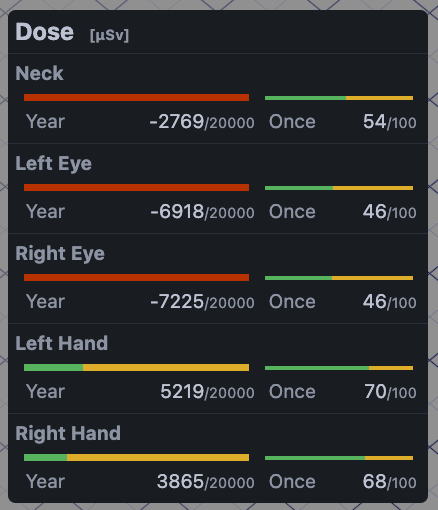

左側が年間の上限被ばく量(20,000[&micro;Sv])，右側が一回の目標上限被ばく量に対して被ばく量を表しています。
ゲームの体力バーのような部分では，黄色で被ばく量を表しており，上限被ばく量を超えると赤色になります。
数値の方では，上限被ばく量から被ばく量を引いた値を表示しています。

被ばく量以外にも防護具，防護板の影響を受けた場合，対応するアイコンが表示されます。

    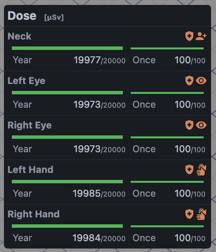

今回の教材内では，被ばく量に対して防護具で0.1倍，防護板で0.01倍になるようにしています。
（防護具は種類によらず，全て0.1倍としています）

---
# 操作マニュアル

## 操作パネル
#### Scene

##### Gimmick
シーン毎に固有の結果を返す項目と，3D空間内のコントローラーを非表示にする`viewing`が操作できます。

レントゲン室では，`curtain`でカーテンの有無を操作できます。

<!-- FIXME: -->

    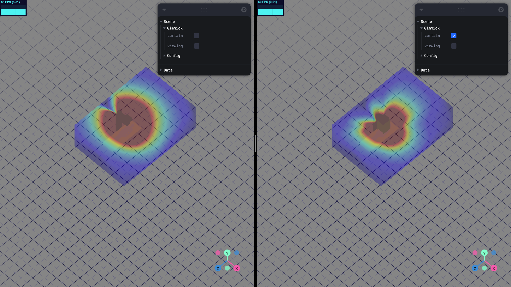

Cアームでは，`type`で患者に対して真上から照射した場合の`type 1`と，横から照射した場合の`type 2`に切り替えられます。

<!-- FIXME: -->

    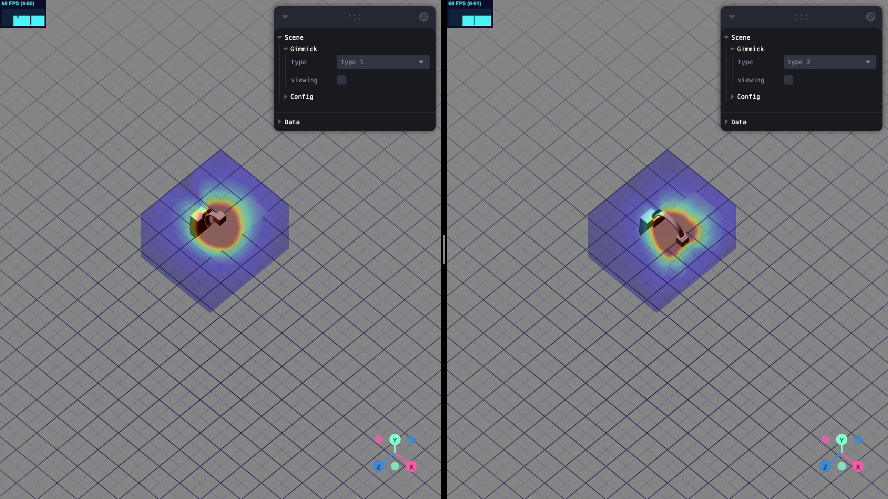

#### Player

##### Equipments
放射線防護具の装備の有無を選択できます。

    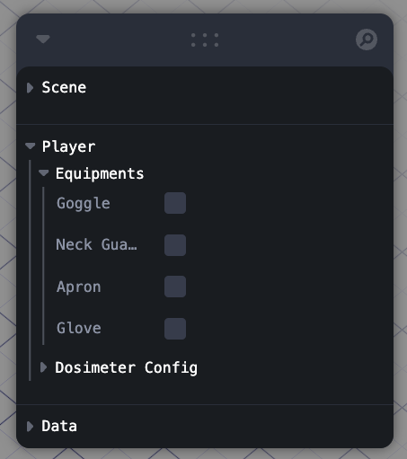

装備を有効にすることで，線量計UIに種類に応じたアイコンが表示され，被ばく量が変化します。

##### Dosimeter Config
線量計UIの表示と，被ばく量の計算に関係する値の設定ができます。

    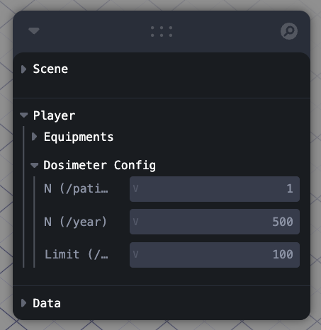

- `N (/patient)`：患者一人に対して行う照射回数
- `N (/year)`：年間に実施を予定している処置回数
- `Limit (/once)`：一回の処置での目標上限線量

年間の被ばく量は`N (/patient) * N (/year)`，一回の被ばく量は`N (/patient)`で計算されます。

#### Data

##### mode
時間経過データ(`time lapse`)と累積データ(`accumulate`)の2つのデータ表示形式を設定できます。

    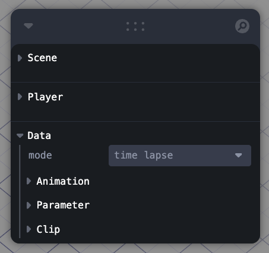

##### Animation
データ表示形式が`time lapse`の際，アニメーションを操作できます。

    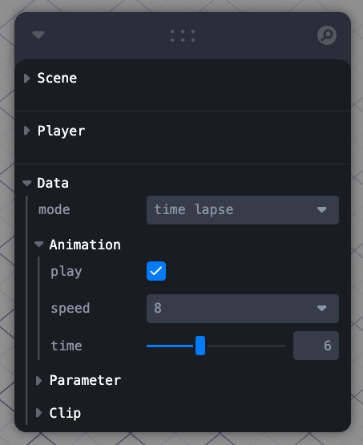

- `play`：再生・停止
- `speed`：再生速度（`0.25`, `0.5`, `1`, `1.5`, `2`, `8`, `16`から選択できます）
- `time`：再生位置

##### Parameter
線量分布データの描画に関係する値を設定できます。

    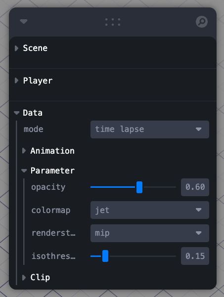

- `opacity`：不透明度
- `colormap`：データに適用されるカラーマップ
- `renderstyle`：描画形式（`mip`（Maximuｍ Intensity Projection, 最大値投影），`iso`（Isosurface, 等値面）が選択できます）
- `isothreshold`：描画される下限の閾値（`renderstyle`が`iso`の時のみ反映されます）

##### Clip
X, Y, Z軸に垂直なクリッピング平面3つと，自由に位置・向きを変更できるクリッピング平面の4つについて，それぞれ有効にするか操作ができます。
また，それぞれのクリッピング平面の向きを反転させることもできます。

    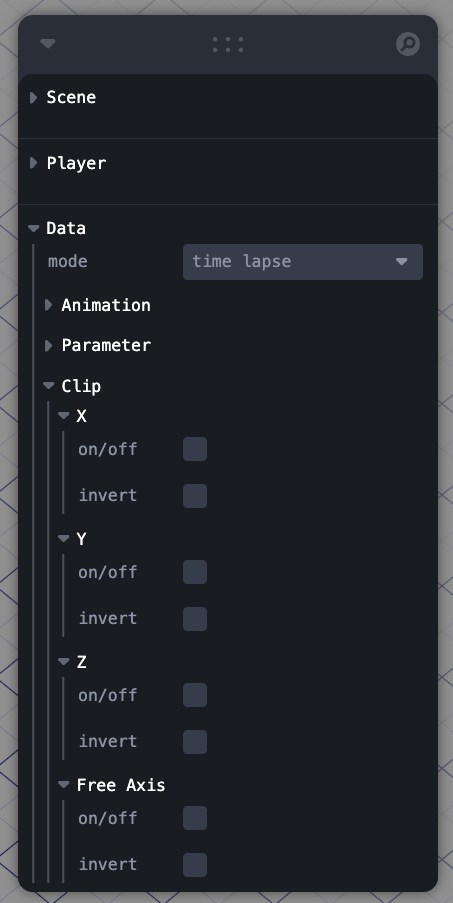

<!-- --- -->
## 3D空間
3D空間内でのオブジェクトの操作には[PivotControls](https://github.com/pmndrs/drei#pivotcontrols)というコントローラーを採用しており，
- 矢印に対して左ボタンをドラッグ：選択した軸上を移動
- 四角に対して左ボタンをドラッグ：選択した平面上を移動
- 弧に対して左ボタンをドラッグ：選択した軸周りに回転

となっています。

[gif/PivotControls]

#### Player
プレイヤーの位置，手の位置を移動させることで，被ばく量が変化します。

<!-- FIXME: -->

    

#### Shield
防護板を線量分布内に移動させることで，線量分布に影響が反映されます。

<!-- FIXME: -->

    

また，防護板とプレイヤーの位置関係を調整することで，線量計UIに防護板の影響を示すアイコンが表示され，被ばく量が変化します。

#### Clipping Plane
操作パネル内の`Clip`で有効にしたクリッピング平面が3D空間内に表示され，操作が可能になります。
クリッピングの断面となる部分には赤い枠が表示されます。

<!-- FIXME: -->

    

有効にした全ての平面に対してクリッピングが成り立つ部分がクリッピングされます。
例えば，XとZを有効にした場合，下図のような結果になります。

<!-- FIXME: -->

    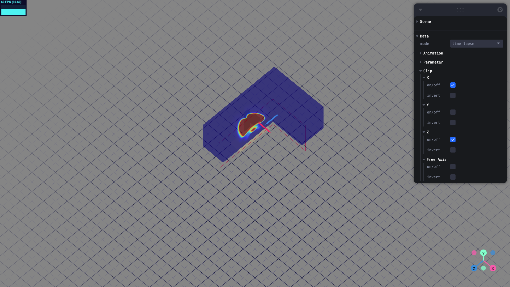

