# Experiment (Visualization, 1st)

## Experiment Content
You are required to implement all the contents of the checklist as visualization materials in the X-ray room and on at least one page of the C-arm.

- X-ray room: https://ireansan.github.io/radiation_protection_education/visualization/extra/X-Ray/
- C-arm: https://ireansan.github.io/radiation_protection_education/visualization/extra/C-Arm/

Once all of this is done, the left side of the figure below will look like the right side, and the Google Forms link will be accessible, so please respond.

    

### Checklist Details
Note: Once an operation is performed, it is recorded as "performed," so it is not necessary to fulfill all items at the same time.

#### equipments
Activate all 4 equipments in `Player/Equipments` in the operation panel

#### data mode
Operate `Data/mode` on the operation panel to check the dose distribution in two data modes, `time lapse` and `accumulate`.

#### color map
Operate `Data/Parameter/colormap` on the operation panel and check all 13 types of colormaps.

#### render style
Operate `Data/Parameter/renderstyle` in the operation panel and check the dose distribution with two rendering styles, `mip` and `iso`

#### clip x, y, z, free axis
Activate all clipping planes in `Data/Clip` in the operation panel

#### clip invert
Activate `invert` and reverse the orientation of one of the clipping planes in `Data/Clip` in the operation panel

#### player
The player's position and the positions of both hands are changed by operating the controller in the 3D space

#### shield
Operate the controller in the 3D space, place the protective plate in the dose distribution, and check how the dose changes by moving it

---
# Screen structure
The screen structure of this material is divided into three main sections.

    

### 3D space
Dose distribution data, 3D objects as players, and protective boards are displayed.

The [OrbitControls](https://threejs.org/docs/#examples/en/controls/OrbitControls) controller is used to control the camera.
- Drag the left button: Rotate
- Right button drag: Pan
- Mouse wheel: Zoom

### Operation panel
The panel allows manipulation of dose distribution data, dosimeter UI, and numerical values related to the entire 3D space, etc.

Detailed information is provided in the operation manual.

### UI
#### Dosimeter
The exposure dose is obtained from a virtual dosimeter tied to the player and displayed.

    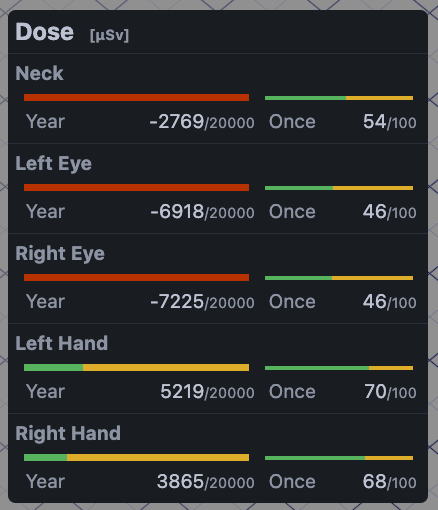

The left side shows the annual upper limit exposure dose (20,000[&micro;Sv]), and the right side shows the exposure dose against the target upper limit exposure dose per exposure.
In the part that looks like a strength bar in a game, the exposure dose is shown in yellow, and it turns red when the upper limit exposure dose is exceeded.
The numerical value shows the upper exposure limit minus the exposure dose.

If the exposure dose is affected by protective equipment or protective plates in addition to the exposure dose, the corresponding icon will be displayed.

    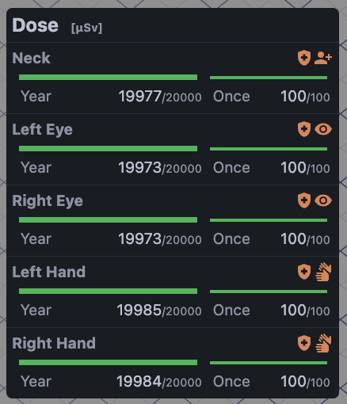

In the present teaching material, the exposure dose is set to 0.1 times for protective equipment and 0.01 times for protective plates.
(All protective equipment is assumed to be 0.1 times the dose, regardless of type.)

The types of icons are as follows
<table>
    <tr>
        <th>Category</th>
        <th>Icon</th>
    </tr>
    <tr>
        <td>Shield</td>
        <td>
            

                
            

        </td>
    </tr>
    <tr>
        <td>Goggle</td>
        <td>
            

                
            

        </td>
    </tr>
    <tr>
        <td>Neck Guard</td>
        <td>
            

                
            

        </td>
    </tr>
    <tr>
        <td>Apron</td>
        <td>
            

                
            

        </td>
    </tr>
    <tr>
        <td>Glove</td>
        <td>
            

                
            

        </td>
    </tr>
</table>

---
# Operation Manual

## Operation panel
### Scene

#### Gimmick
You can manipulate items that return scene-specific results and `viewing` that hides the controller in 3D space.

In the x-ray room, the `curtain` can be used to control the presence or absence of a curtain.

    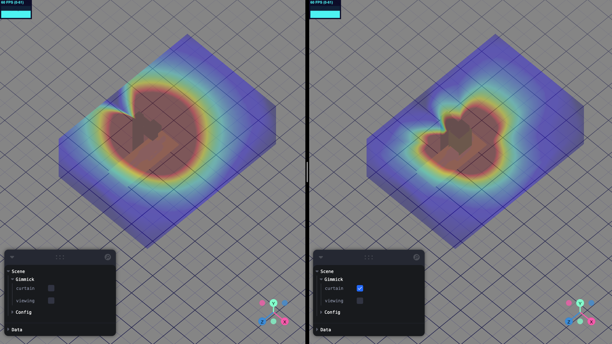

In the C-arm, the `type` can be switched between `type 1`, when irradiated from directly above the patient, and `type 2`, when irradiated from the side.

    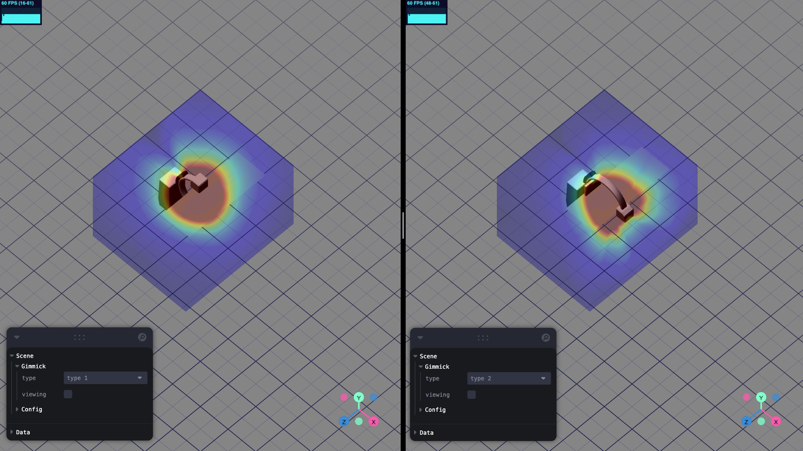

### Player

#### Equipments
You can select whether or not you are equipped with radiation protection equipment.

    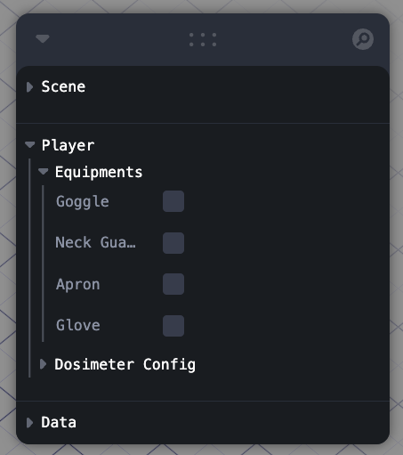

By activating the equipment, the dosimeter UI displays icons according to the type and the exposure dose.

#### Dosimeter Config
You can display the dosimeter UI and set values related to the calculation of the exposure dose.

    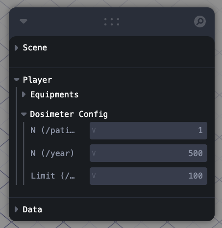

- `N (/patient)`: Number of irradiations to be performed on one patient.
- `N (/year)`: Number of procedures planned to be performed per year.
- `Limit (/once)`: Target upper dose limit per treatment

The annual exposure dose is calculated as `N (/patient) * N (/year)` and the one-time exposure dose as `N (/patient)`.

### Data

##### mode
Two data display formats can be set: time lapse data (`time lapse`) and cumulative data (`accumulate`).

    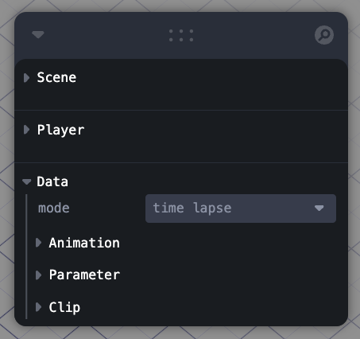

#### Animation
When the data display format is `time lapse`, animation can be manipulated.

    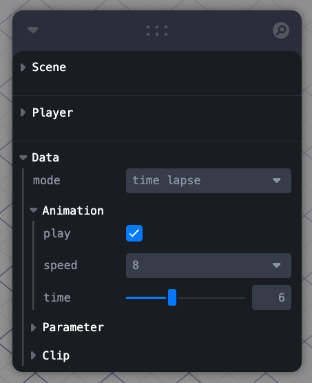

- `play`: play / stop.
- `speed`: playback speed (selectable from `0.25`, `0.5`, `1`, `1.5`, `2`, `8`, `16`)
- `time`: playback position.

#### Parameter
You can set values related to the plotting of dose distribution data.

    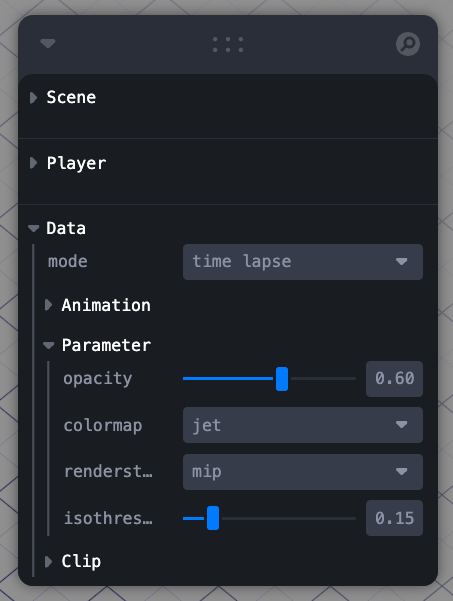

- `opacity`: opacity
- `colormap`: colormap to be applied to the data
- `renderstyle`: the rendering style (you can choose between `mip` (Maximum Intensity Projection) and `iso` (Isosurface))
- `isothreshold`: the lower threshold to be rendered (this is reflected only when `renderstyle` is `iso`).

Please refer to [this link](https://github.com/yuki-koyama/tinycolormap) for the type of color map.

#### Clip
You can enable or disable each of the four clipping planes: the three clipping planes perpendicular to the X, Y, and Z axes, and the clipping planes whose position and orientation can be freely changed.
The orientation of each clipping plane can also be reversed.

    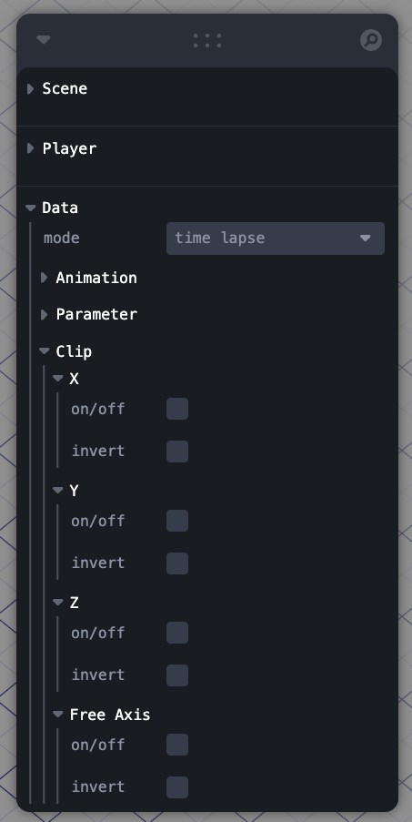

<!-- --- -->
## 3D空間
The controller [PivotControls](https://github.com/pmndrs/drei#pivotcontrols) is used to manipulate objects in 3D space.
- Drag the left button against an arrow: Move on the selected axis.
- Drag the left button on a square: move it on the selected plane
- Drag left button on an arc: Rotate around the selected axis

### Player
The amount of exposure is changed by moving the position of the player and the position of the hand.

    

### Shield
Moving the protective plate into the dose distribution reflects the effect on the dose distribution.

    

By adjusting the positional relationship between the protective board and the player, the dosimeter UI displays an icon indicating the effect of the protective board, and the exposure dose changes.

### Clipping Plane
The clipping plane activated by `Clip` in the operation panel is displayed in 3D space and can be manipulated.
A red frame is displayed around the section of the clipping plane.

    

For all enabled planes, the part of the image for which clipping is valid will be clipped.
For example, if X and Z are enabled, the result will be as shown below.

    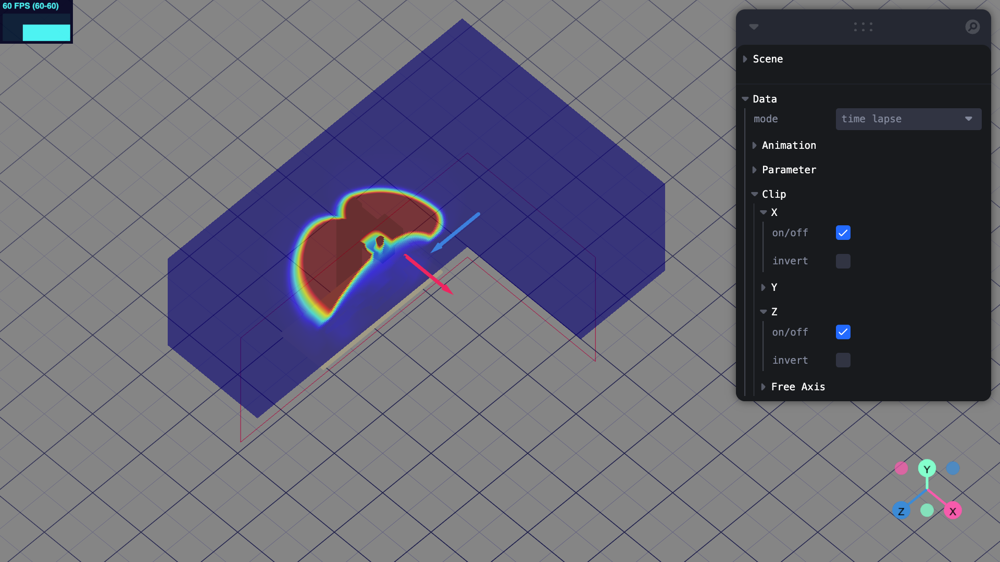

